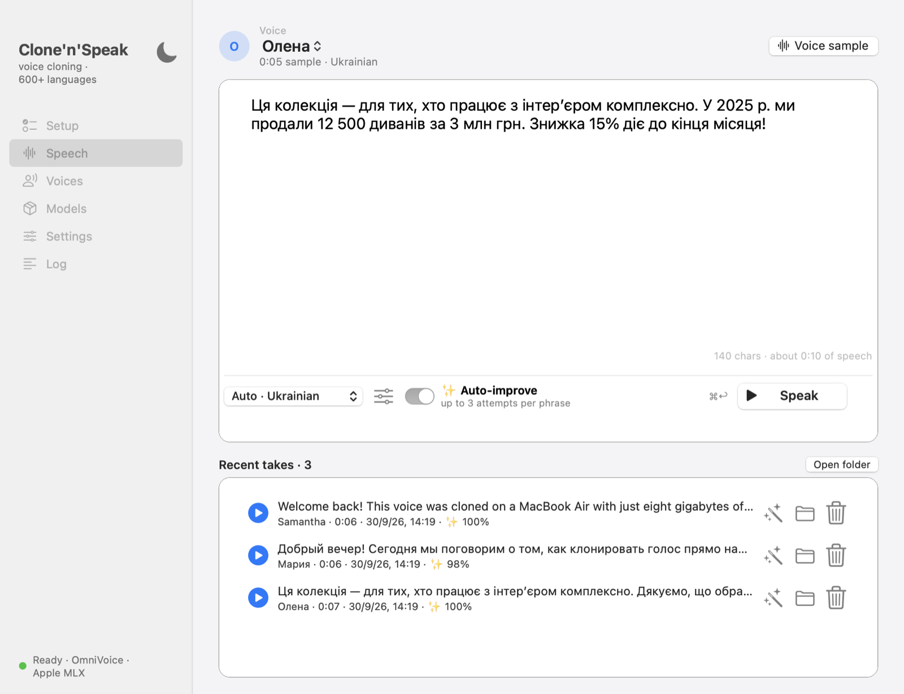
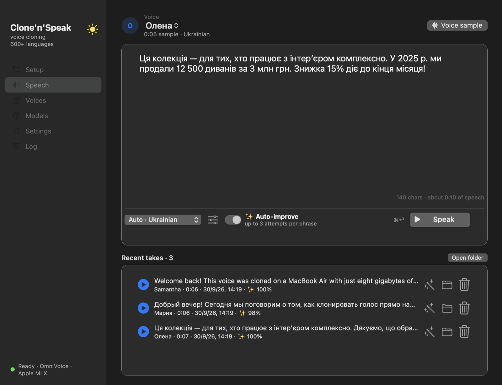
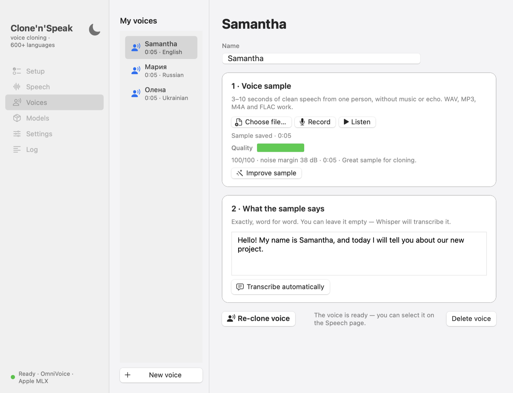
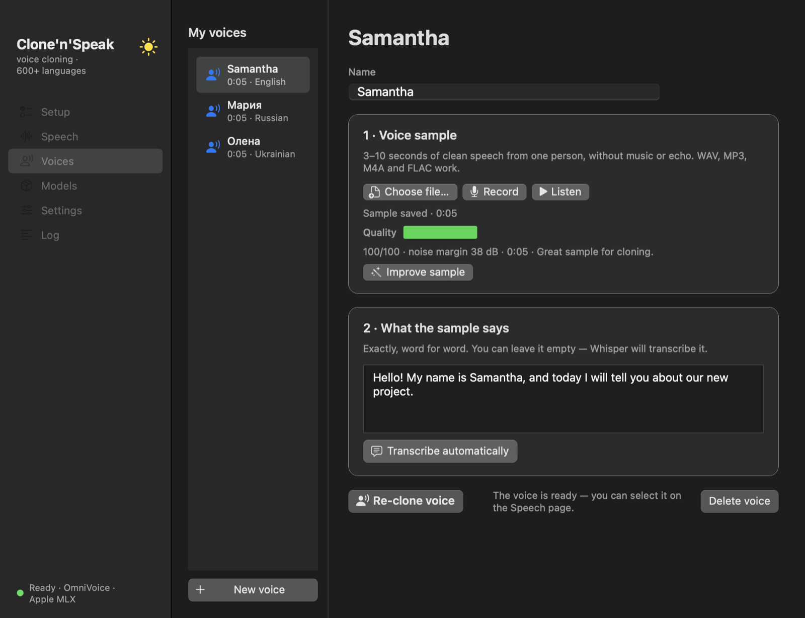
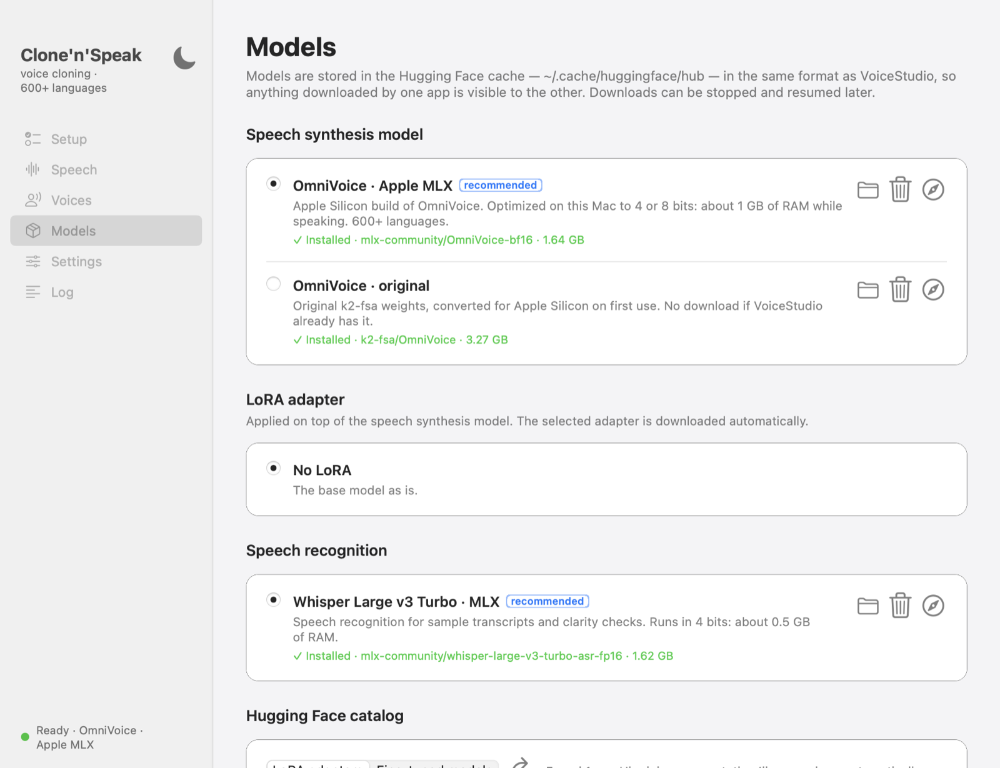
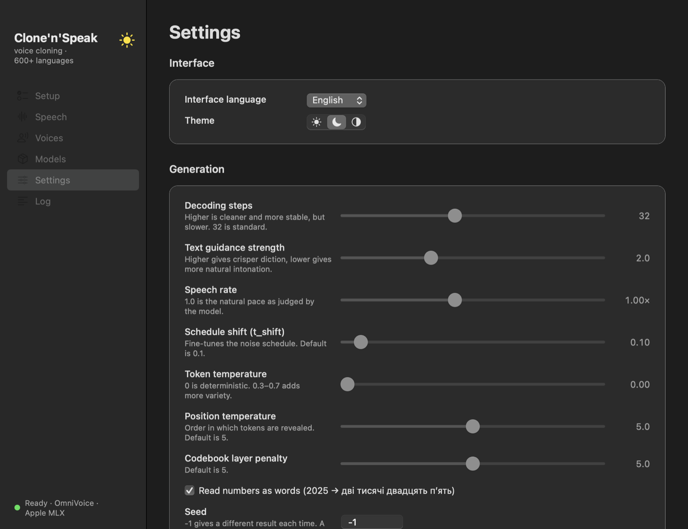
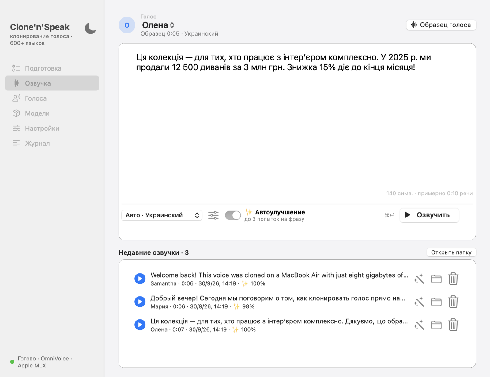

# Clone'n'Speak

**Voice cloning and text-to-speech in 600+ languages for Apple Silicon Macs — built to run well on an 8 GB M1.**

Clone'n'Speak is a small native macOS app (Objective-C / AppKit) around the open
[OmniVoice](https://github.com/k2-fsa/OmniVoice) model, running on Apple's [MLX](https://github.com/ml-explore/mlx)
through [mlx-audio](https://github.com/Blaizzy/mlx-audio). It is a lightweight alternative to
[VoiceStudio](https://github.com/debpalash/VoiceStudio), focused on one job: **clone a voice and speak text with it,
well, on a weak Mac.** VoiceStudio keeps its whole Python backend (around 3 GB of RAM) loaded; Clone'n'Speak keeps only one model in memory
at a time, in full 16-bit quality, and gives the memory back when idle.

Everything runs locally. No cloud, no account, no subscription.

[Русская версия ↓](#русский)

<p align="center">
  
  
</p>

## Why it is light

| | Clone'n'Speak | OmniVoice on PyTorch |
|---|---|---|
| Python environment on disk | ~360 MB (MLX, no PyTorch) | ~1.1 GB |
| Voice model | full 16-bit, loaded straight from the download | 3.3 GB fp32 |
| RAM while speaking | ~3 GB peak, Whisper unloaded meanwhile | ~4.2 GB |
| RAM while transcribing | ~1.9 GB (Whisper 16-bit), voice model unloaded meanwhile | +4 GB on top |
| RAM when idle | ~0 — the engine is unloaded after a few idle minutes | stays loaded |
| Speed on M1 | ~real time (10 s of speech ≈ 10 s) | similar |

How: speech recognition and synthesis **take turns** in memory, so an 8 GB Mac with 2–3 GB free runs both at full
quality; text is spoken sentence by sentence, so memory doesn't grow with the text length; MLX's buffer cache is capped.
The app shows the engine's memory and the free memory live, and on Macs with less RAM you can switch to 8-bit.

## Features

- **Voice cloning from 3–10 seconds** — pick a file or record from the microphone.
  - *Sample check*: loudness, noise, clipping, pauses → a 0–100 score with tips.
  - *Improve sample*: noise reduction, rumble filter, shorter pauses, level normalisation (the original is kept).
  - *Transcript check*: Whisper listens to the sample (in the sample's language you pick, Ukrainian by default) and warns when your transcript doesn't match it —
    the most common reason for a bad clone.
  - *Instant preview*: the new voice says a short phrase right after cloning.
- **600+ languages**, auto-detected while you type (Apple NaturalLanguage) or picked from the list.
- **✨ Auto-improve**: every phrase is spoken, checked by speech recognition and re-spoken if unclear; you get a clarity
  score and the list of phrases that stayed hard.
- **Stress marks**: select a vowel and press **Stress ´** (⌘') — `виши́вка` — to fix a misplaced stress.
- **Ukrainian text preparation**: years (`у 2025 р.` → *у дві тисячі двадцять п'ятому році*), numbers with units in the
  right grammatical form (`21 грн` → *двадцять одна гривня*), abbreviations, apostrophes.
- **LoRA adapters and fine-tunes** from Hugging Face are discovered automatically; the chosen one is downloaded,
  merged and quantized for your Mac. Your own adapter can be added from a folder.
- **Zero setup**: on first launch the app installs its own Python + MLX (~360 MB) and the model (1.6 GB) with
  progress in the window. No Homebrew, no terminal.
- **Shared Hugging Face cache** (`~/.cache/huggingface/hub`, the standard layout used by VoiceStudio and
  `huggingface_hub`): models already downloaded by other apps are reused, including the original `k2-fsa/OmniVoice`.
- Live memory meter: how much the engine uses and how much is still free.
- English and Russian interface, light and dark themes, ~500 KB native binary.

<p align="center">
  
  
</p>
<p align="center">
  
  
</p>

## Tips for a great clone

1. **Record the sample in the language you will synthesize.** The sample's accent carries over; the app warns you when
   the languages differ.
2. 5–10 seconds of natural speech from one person, in a quiet room, without music or echo. Aim for a quality score of 80+.
3. **The transcript must match the recording word for word.** Leave it empty to let Whisper fill it in, or let the app
   check it for you.
4. Noisy recording? Press **Improve sample**, then re-clone.
5. For long texts turn on **✨ Auto-improve**; rewrite phrases it reports as unclear (expand abbreviations, add commas).
6. Want a different accent or a narrow domain? Train a LoRA adapter on a rented NVIDIA GPU with the
   [official recipe](https://github.com/k2-fsa/OmniVoice/blob/master/docs/lora_finetuning.md) and add the folder in
   *Models → Add your own model or LoRA*. (As of now there are no public Ukrainian OmniVoice adapters; OmniVoice was
   pre-trained on ~1,850 hours of Ukrainian, so a clean Ukrainian sample already gives native pronunciation.)

## Requirements

- Mac with Apple Silicon (M1 or newer), macOS 13 Ventura or later — 8 GB of RAM is enough
- ~3 GB of free disk space, internet on first launch

## Install

Download `CloneNSpeak-x.y.z.dmg` from [Releases](../../releases), open it and drag the app to *Applications*.

The build is not notarized yet, so macOS says it “could not verify” the app. Remove the quarantine flag and launch it:

```bash
xattr -dr com.apple.quarantine "/Applications/Clone'n'Speak.app"
open "/Applications/Clone'n'Speak.app"
```

Or: *System Settings → Privacy & Security* → **Open Anyway** (on macOS 15 “right-click → Open” no longer works).

## Build from source

Only the Xcode Command Line Tools are needed (`xcode-select --install`):

```bash
./build.sh          # → build/Clone'n'Speak.app
./build.sh --run    # build and launch
./build.sh --dmg    # + dist/CloneNSpeak-<version>.dmg
```

- Tests: `python3 -m unittest discover -s tests` (needs `pip install num2words`)
- Translations: `python3 tools/strings.py check`
- Xcode project: `python3 tools/gen_xcodeproj.py`
- Signed & notarized DMG: `SIGN_IDENTITY="Developer ID Application: …" NOTARY_PROFILE=notary ./build.sh --dmg`.
  Pushing a `v*` tag builds the DMG in GitHub Actions and attaches it to a release.

### How it works

```
AppKit UI (Objective-C) ──JSON lines──▶ worker.py (Python, one long-lived process)
  OVRuntime  installs Python + MLX with uv       OmniVoice on MLX (mlx-audio), 4/8/16-bit
  OVModels   Hugging Face cache, catalog, LoRA   Whisper on MLX for transcripts & clarity checks
  OVWorker   requests, progress, idle unload     sample analysis / cleanup, Ukrainian text prep
  OVLocale   UI language, language detection, theme
```

| Where | What |
|---|---|
| `~/.cache/huggingface/hub` | downloaded models (configurable in *Models*) |
| `~/Library/Application Support/Clone'n'Speak` | Python engine, optimized models, voices, logs |
| `~/Music/Clone'n'Speak` | generated WAV files |

## License

MIT — see [LICENSE](LICENSE). OmniVoice © k2-fsa (Apache-2.0); model weights keep their authors' licenses.
Only clone a voice with the consent of its owner.

---

<a id="русский"></a>

# Clone'n'Speak (по-русски)

**Клонирование голоса и озвучка текста на 600+ языках для Mac на Apple Silicon — рассчитано на M1 с 8 ГБ памяти.**

Clone'n'Speak — небольшое нативное macOS-приложение (Objective-C / AppKit) для открытой модели
[OmniVoice](https://github.com/k2-fsa/OmniVoice), которая работает на фреймворке Apple [MLX](https://github.com/ml-explore/mlx)
через [mlx-audio](https://github.com/Blaizzy/mlx-audio). Это облегчённая альтернатива
[VoiceStudio](https://github.com/debpalash/VoiceStudio) с одной задачей: **качественно клонировать голос и озвучивать им
текст на слабом Mac.** Запущенный Python-бэкенд VoiceStudio сам по себе занимает около 3 ГБ памяти; Clone'n'Speak
держит в памяти только одну модель в полном 16-битном качестве и освобождает память при простое.

Всё работает локально: без облака, аккаунтов и подписок.

<p align="center">
  
</p>

## Почему лёгкое

| | Clone'n'Speak | OmniVoice на PyTorch |
|---|---|---|
| Python-окружение на диске | ~360 МБ (MLX, без PyTorch) | ~1,1 ГБ |
| Модель голоса | полные 16 бит, грузится прямо из скачанных файлов | 3,3 ГБ fp32 |
| Память при озвучке | пик ~3 ГБ, Whisper в это время выгружен | ~4,2 ГБ |
| Память при распознавании | ~1,9 ГБ (Whisper 16 бит), модель голоса выгружена | ещё +4 ГБ |
| Память в простое | ~0 — движок выгружается через несколько минут | остаётся загруженным |
| Скорость на M1 | ~реальное время (10 с речи ≈ 10 с) | примерно так же |

Распознавание и синтез **загружаются по очереди**, поэтому Mac с 8 ГБ и 2–3 ГБ свободной памяти работает с обеими моделями
в полном качестве; текст озвучивается по фразам, кеш MLX ограничен. Приложение в реальном времени показывает, сколько
занимает движок и сколько памяти свободно; на Mac с меньшим объёмом можно переключиться на 8 бит.

## Возможности

- **Клонирование по 3–10 секундам** — из файла или записью с микрофона:
  оценка качества образца (шум, громкость, перегруз, паузы) с подсказками; кнопка **«Улучшить образец»**
  (шумоподавление, срез гула, сокращение пауз, выравнивание громкости, оригинал сохраняется);
  **проверка текста образца** — Whisper слушает запись и предупреждает, если текст не совпадает (главная причина плохого
  клона); **пробная фраза** новым голосом сразу после клонирования.
- **600+ языков** с автоопределением по тексту или выбором из списка.
- **✨ Автоулучшение**: каждая фраза проверяется распознаванием речи и переозвучивается, если звучит неразборчиво.
- **Ударения**: выделите гласную и нажмите **«Ударение ´»** (⌘') — `виши́вка`, — чтобы исправить неверное ударение.
- **Подготовка украинского текста**: годы, числа с единицами в правильной форме, сокращения, апострофы.
- **LoRA-адаптеры и дообученные модели** с Hugging Face находятся сами, выбранные скачиваются, вливаются и
  квантуются под ваш Mac; свой адаптер подключается из папки.
- **Без настройки**: при первом запуске приложение само ставит Python + MLX (~360 МБ) и модель (1,6 ГБ) с прогрессом в окне.
- **Общий кеш Hugging Face** — модели, уже скачанные VoiceStudio и другими программами, используются повторно.
- Английский и русский интерфейс, светлая и тёмная тема.

## Как получить качественный клон

1. **Записывайте образец на том языке, на котором будете озвучивать** — акцент образца переносится (приложение
   предупредит, если языки различаются).
2. 5–10 секунд естественной речи одного человека в тишине, без музыки и эха; оценка качества — от 80.
3. **Текст образца должен совпадать с записью слово в слово** — оставьте поле пустым, и его заполнит Whisper.
4. Шумная запись — нажмите **«Улучшить образец»** и пересоздайте голос.
5. Для длинных текстов включайте **✨ Автоулучшение** и переписывайте фразы, которые оно отметит.
6. Нужен особый акцент или тематика — обучите LoRA на арендованной видеокарте NVIDIA по
   [официальному рецепту](https://github.com/k2-fsa/OmniVoice/blob/master/docs/lora_finetuning.md) и подключите папку
   в «Модели». Публичных украинских адаптеров OmniVoice пока нет, но в обучении модели было ~1850 часов украинской речи —
   чистый украинский образец уже даёт естественное произношение.

## Требования и установка

Mac на Apple Silicon (M1 и новее), macOS 13+, 8 ГБ памяти достаточно, ~3 ГБ на диске, интернет при первом запуске.
Скачайте `CloneNSpeak-x.y.z.dmg` в [Releases](../../releases) и перетащите приложение в «Программы».

Сборка пока не нотаризована, поэтому macOS пишет, что «не удалось подтвердить» файл. Снимите карантинную пометку и запустите:

```bash
xattr -dr com.apple.quarantine "/Applications/Clone'n'Speak.app"
open "/Applications/Clone'n'Speak.app"
```

Или: «Системные настройки» → «Конфиденциальность и безопасность» → **«Всё равно открыть»** (в macOS 15 «правый клик → Открыть» больше не работает).
Сборка из исходников — `./build.sh`, запуск — `open "build/Clone'n'Speak.app"`.

## Лицензия

MIT. OmniVoice © k2-fsa (Apache-2.0). Клонируйте голос только с согласия его владельца.
